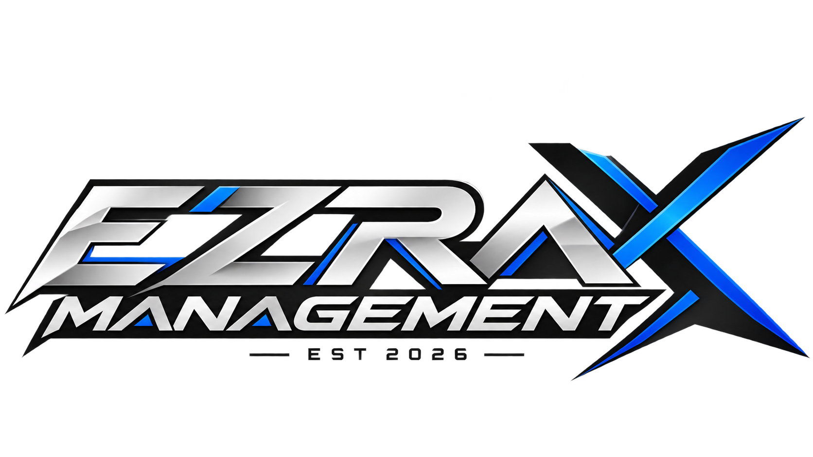

# 🚀 Ezra Management X

> **Ezra Management X — developed by Rejax (MOHAMMAD FIKI FAKHREZA).**

Ezra Management X is a management system project developed and maintained by **Rejax** under **Ezra Global Prima**.

**Founded:** 5 January 2026

## 👨‍💻 Developer

| Information | Details |
|---|---|
| Name | **MOHAMMAD FIKI FAKHREZA** |
| Developer Alias | **Rejax** |
| Organization | **Ezra Global Prima** |
| Project | **Ezra Management X** |
| Founded | **5 January 2026** |
| Telegram | **@xrejax** |

## ✨ Features

- 👥 User management
- 🔐 Role & permission management
- 👑 Hierarchical access control
- 📊 Management features
- 📝 Configuration system
- 🛡️ Security considerations
- 📚 Project documentation
- 🔧 Modular and extensible structure

## 👑 Role Hierarchy

```text
👨‍💻 DEVELOPER
       ↓
👑 OWNER UTAMA
       ↓
👑 OWNER
       ↓
🔴 ADMIN
       ↓
🔵 RESELLER
       ↓
🟣 MODERATOR
       ↓
🟢 VIP
       ↓
⚪ MEMBER
```

## 📚 Documentation

- [About](docs/about.md)
- [Features](docs/features.md)
- [Installation](docs/installation.md)
- [Configuration](docs/configuration.md)
- [Commands](docs/commands.md)
- [Roles](docs/roles.md)
- [Developer](docs/developer.md)
- [FAQ](docs/faq.md)

## 🖼️ Project Logo

<p align="center">
  
</p>

## 🔗 Official Links

- **GitHub Repository:** https://github.com/ezraglobalprima/Ezra-Management-X
- **GitHub Profile:** https://github.com/ezraglobalprima
- **Telegram:** https://t.me/xrejax
- **Website:** TBA
- **Telegram Channel:** TBA

## 🏢 Ezra Global Prima

Ezra Management X is associated with **Ezra Global Prima**.

## 📜 License

See [`LICENSE`](LICENSE) for license information.

## 🛡️ Security

See [`SECURITY.md`](SECURITY.md) for security information.

## 🤝 Contributing

See [`CONTRIBUTING.md`](CONTRIBUTING.md) for contribution guidelines.

## ⭐ Project

If you find **Ezra Management X** useful, consider giving the repository a ⭐.

---

> **Ezra Management X**  
> Developed by **Rejax (MOHAMMAD FIKI FAKHREZA)**  
> **Ezra Global Prima — EST. 2026**
